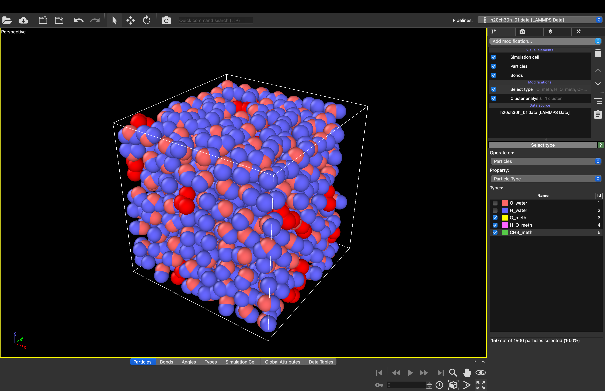
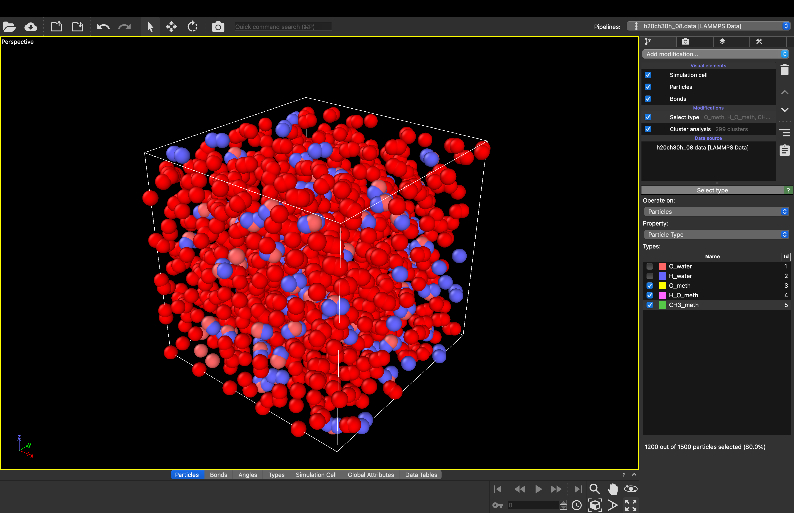

# Example of More Features

***

## Methanol and Water Mixes

| 10% Methanol Mix | 80% Methanol Mix |
| ---------------- | ---------------- |
|  |  |
| Input Data File for 10% Mix | Input Data File for 80% Mix |

***

## Code that can be copied to run elsewhere


```{code-cell} python
import numpy as np
import matplotlib.pyplot as plt
import matplotlib.animation as animation
from IPython.display import HTML

# Make the plots look professional
plt.style.use('seaborn-v0_8-whitegrid')
plt.rcParams['figure.figsize'] = (6, 6)
plt.rcParams['font.size'] = 12

# GLOBAL CONSTANTS (The "Universe" Settings)
BOX_SIZE = 10.0      # The size of our container
SIGMA = 1.0          # The size of an atom
EPSILON = 1.0        # The strength of attraction
MASS = 1.0           # The mass of an atom
```

```{code-cell} python
# --- LOGIC: STRICT INITIALIZATION ---
N_PARTICLES = 20
MIN_DIST = 1.12 * SIGMA  # Distance where atoms repel (2^(1/6))
MAX_ATTEMPTS = 5000      

positions = np.zeros((N_PARTICLES, 2))

# 1. Place Atoms (Checking for Overlaps + Boundaries)
for i in range(N_PARTICLES):
    placed = False
    attempts = 0
    while not placed and attempts < MAX_ATTEMPTS:
        candidate = np.random.rand(2) * BOX_SIZE
        
        if i == 0:
            positions[i] = candidate
            placed = True
        else:
            # Calculate distance to all existing atoms
            delta = positions[:i] - candidate
            
            # --- PERIODIC BOUNDARY CHECK ---
            # If atoms are on opposite edges (0 and 10), they are actually close!
            delta -= np.round(delta / BOX_SIZE) * BOX_SIZE 
            
            dist_sq = np.sum(delta**2, axis=1)
            
            # If ALL existing atoms are far enough away, we accept this spot
            if np.all(dist_sq > MIN_DIST**2):
                positions[i] = candidate
                placed = True     
        attempts += 1
    
    if not placed:
        print(f"Warning: Failed to place particle {i}. Box is too full.")

# 2. Generate Velocities
# Random values between -0.5 and 0.5
velocities = (np.random.rand(N_PARTICLES, 2) - 0.5)

# Center of Mass Correction
# We subtract the average so the gas doesn't drift
velocities -= np.mean(velocities, axis=0)

# --- VISUALIZATION ---
fig, ax = plt.subplots(figsize=(6,6))
ax.set_xlim(0, BOX_SIZE); ax.set_ylim(0, BOX_SIZE)
ax.set_title(f"Initial State (N={N_PARTICLES})")
ax.set_xlabel("Position X"); ax.set_ylabel("Position Y")

# 1. Draw Atoms (Blue Circles)
ax.scatter(positions[:,0], positions[:,1], s=300, color='skyblue', edgecolors='black', alpha=0.8, label='Atom')

# 2. Draw Velocities (Red Arrows)
# Quiver plots arrows at (x,y) with components (u,v)
ax.quiver(positions[:,0], positions[:,1], 
          velocities[:,0], velocities[:,1], 
          color='red', width=0.005, scale=5, label='Velocity Vector')

ax.legend(loc='upper right')
plt.grid(True, linestyle='--', alpha=0.6)
plt.show()
```