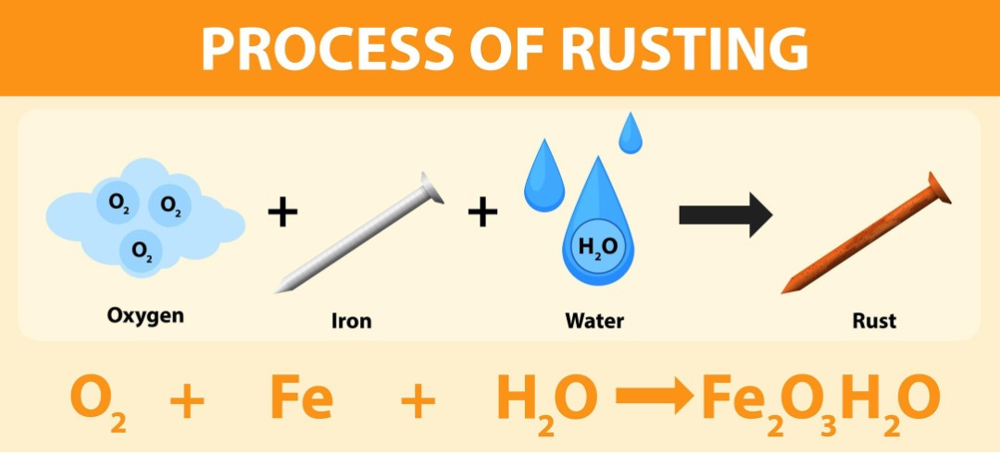
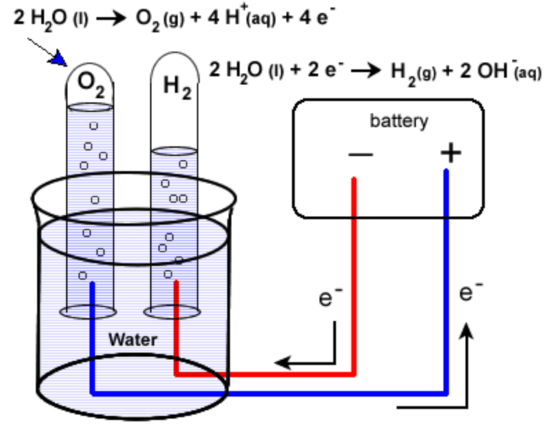
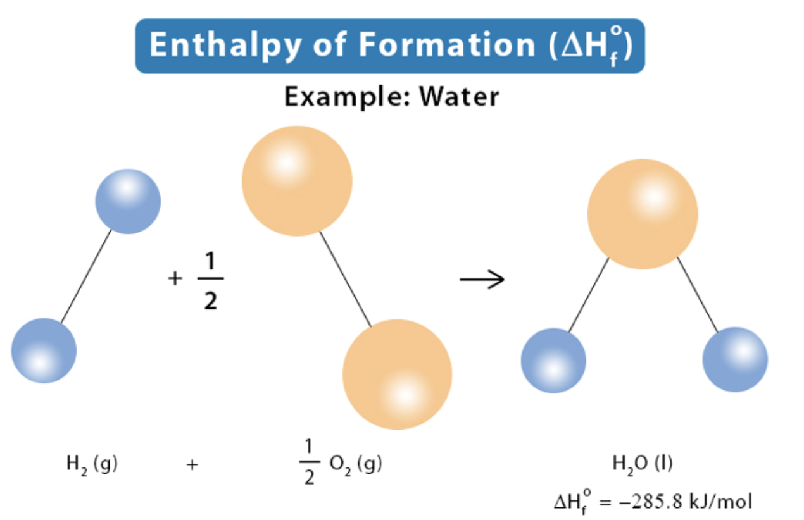
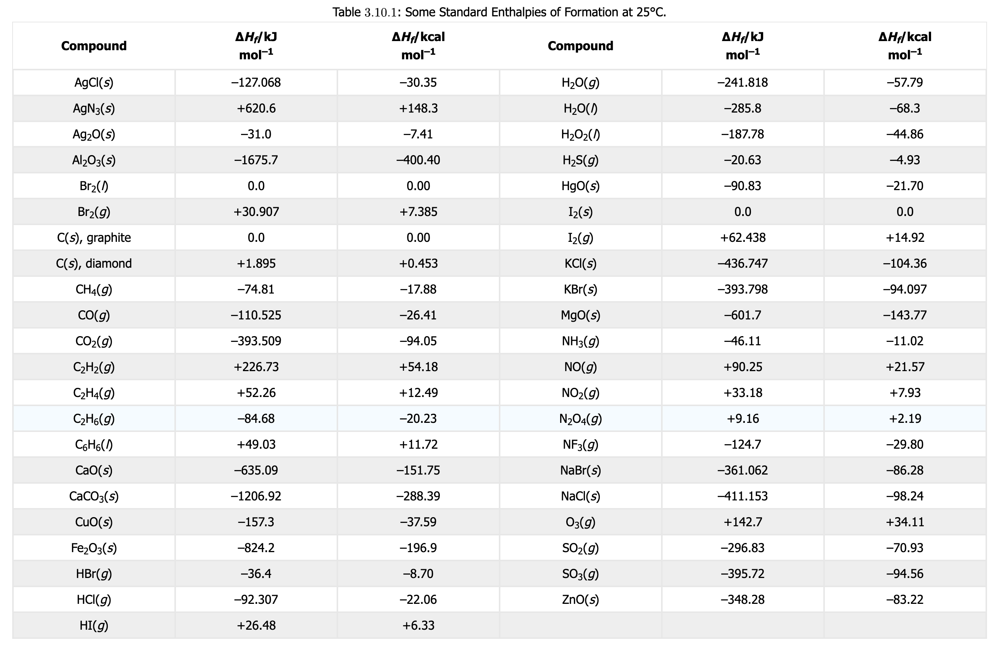

# Machine Learning and Gibbs Free Energy

***

## Background Information

Gibbs Free Energy: Determines if a reaction will occur spontaneously (no external energy needed) or non-spontaneously (external energy needed).  

| Spontaneous Reaction: Iron Oxide (Rust) | Nonspontaneous Reaction: Separating of water (Electrolysis) |
| -- | -- |
|  |  | 
| Water on iron interacts with oxygen to oxidize the iron and cause iron oxide or rust.  This process requires no external energy which makes it a spontaneous process.  | Current is sent through water which is a form of external energy which here is separating the water into the components of hydrogen and oxygen.  Since energy is required for this reaction, it is considered a non-spontaneous reaction.  |

***

Entropy: The disorder of a system in terms of its energy or a measurement of the energy that is present in a system or process but is not available to do work

Second Law of Thermodynamics States entrtopy will always increase over time

$$
\Delta S = \frac{Q_{rev}}{T}
$$

| $\Delta S =$ Entropy | 
| :-- | 
| $Q_{rev} =$ Reversible Heat |
| $T =$ Absolute Temperature |

***

Enthalpy: The total heat content of a thermodynamic system

$$
H = U + PV
$$

| $H =$ Enthalpy |
| :-- |
| $U =$ Internal Energy |
| $PV =$ Pressure multiplied with Volume |

The Internal Energy $U$ of a system is directly related to the molecular system's temperature

The Flow Energy $PV$ of a system is the amount of energy required to maintain the control volume or space taken

The Internal Energy summed with the Flow Energy give you the Enthalpy of a system

***

Enthalpy of Formation: The energy required to create one mole of a molecule from its base elements

Standard Enthalpy of Formation is this energy measured at standard conditions (Pressure = 1 atmosphere and T = 298.15K)

| Example Standard Enthalpy of Formation | Table of Some Standard Enthalpies of Formation | 
| -- | -- |
|  |  |
|  | [Standard Enthalpy of Formation](https://chem.libretexts.org/Bookshelves/General_Chemistry/ChemPRIME_(Moore_et_al.)/03%3A_Using_Chemical_Equations_in_Calculations/3.10%3A_Standard_Enthalpies_of_Formation) | 


***

What is the difference between the Lennard-Jones Potential (LJP) and a Machine Learning Potential (MLP)?  Both are created essentially from viewing data.  

LJP is more physically accurate when viewing reults than ML models.  LJP was created by considering the weak attractive term from van der Waals interactions and the repulsion term based on electron cloud overlap.  LJP has a function form that is derived with sound physics and the parameters of the equation are determined experimentally.  On the other hand MLP are solely based on input data from quantum mechanical data.  

| Properties | Lennard-Jones Potential | Machine Learning Potential |
| -- | -- | -- |
| Number of Parameters | 2 | Many |
| Physical Interpretability | High | Low |
| Data Requirements | Low | High |
| Accuracy with Complex Chemistry | Limited | Can be Extremely High |

Also remember that a Machine Learning Potential is only accurate in what it is trained in, and struggles to extrapolate data accurately.  They aren't any fundamental equations with MLPs, they can be seen as a black box.  

***

In this module we will be using a ML Potential from Many-body Atomic Cluster Expansion (MACE), more specifically, (MACE-OFF) to obtain properties of gaseous molecules.  Below will be both a link to the Google Colab notebook, where you can run the code, and the same code will be copied below with annotation to explain each cell.  

Click the link below to open the Colab notebook:

[](https://colab.research.google.com/github/Earlyrizer64/MyST_site/blob/main/Reference_Files/Google_Colab_Files/Example_Change_In_Enthalpy_Water(Gas).ipynb)

# Code from Google Colab

**Installs Required Packages to run the code**

```python
# Cell 1: Install Required Packages
!pip install ASE
!pip install mace-torch ase rdkit weas-widget

```
**Import needed Libraries to run the code**

```python
# Cell 2: Import Required Libraries
import numpy as np
import matplotlib.pyplot as plt
from ase import Atoms
from ase.build import bulk, molecule
from mace.calculators import mace_mp, mace_off

print("All imports successful.")

```

**Load MACE-OFF (ML Potential that works well with organic molecules whereas MACE-MP-0 works well with metals).  Later we will Modify …mode=”small”,…  to mode=”medium”,… to see the difference in accuracy.**

```python
# Cell 3: Load MACE-OFF

print("Loading MACE-OFF (medium model)...")
calc_mol = mace_off(model="medium", default_dtype="float64")
print("MACE-OFF loaded.")

```

**This cell defines the H2O molecule, identifying each element, and taking their positions to calculate the bond length.**


```python
# Cell 4: Optimize Water Molecule (Gas)
from ase.optimize import BFGS

H_2_O = Atoms('HOH', positions=[(0,0,0), (0.757, 0.586, 0), (1.514, 0, 0)],
            cell=[15, 15, 15], pbc=False)
H_2_O.calc = calc_mol

opt = BFGS(H_2_O, logfile=None)
opt.run(fmax=0.001)

bond_length_OH = H_2_O.get_distance(0, 1)
bond_length_HH = H_2_O.get_distance(1, 2)

E_H_2_O = H_2_O.get_potential_energy()

print(f"Optimized OH bond length: {bond_length_OH:.4f} Å   (exp: 0.9572 Å)")
print(f"H₂O total energy:          {E_H_2_O:.6f} eV")

```

**Calculates Water (gas) Properties when you specify what molecule you input.**

```python
# Cell 5: Calculate Water (gas) Properties
from ase.build import molecule
from ase.optimize import QuasiNewton
from ase.thermochemistry import IdealGasThermo
from ase.vibrations import Vibrations
from ase.units import kJ, mol

atoms_H2O = molecule('H2O')
atoms_H2O.calc = calc_mol
dyn = QuasiNewton(atoms_H2O, logfile=None)
dyn.run(fmax=0.01)
potentialenergy = atoms_H2O.get_potential_energy()

vib = Vibrations(atoms_H2O, name='h2o_vib')
vib.clean()
vib.run()
vib_energies = vib.get_energies()
vib_energies = np.array([e.real for e in vib_energies if e.real > 0.01])


thermo = IdealGasThermo(
    vib_energies=vib_energies,
    potentialenergy=potentialenergy,
    atoms=atoms_H2O,
    geometry='nonlinear', # Linear (Straight Line) or Nonlinear (Bent in any way)
    symmetrynumber=2, # How many times you can rotate the molecule and get the same configuration
    spin=0, # 0.5 for each unpaired electrons
)
#G_H2O = thermo.get_gibbs_energy(temperature=298.15, pressure=101325.0, verbose=False)
H_H2O = thermo.get_enthalpy(temperature=298.15, verbose=False)

H_H2O_kJ = H_H2O * (1/(kJ/mol))

print(f"Enthalpy of H₂O at 298 K: {H_H2O_kJ:.4f} kJ/mol")

```

**Calculates the same information as cell above for H{sub}`2`**


```python
# Cell 6: Calculate Enthalpy for H{sub}`2`

atoms_H2 = molecule('H2')
atoms_H2.calc = calc_mol
dyn = QuasiNewton(atoms_H2, logfile=None)
dyn.run(fmax=0.01)
potentialenergy = atoms_H2.get_potential_energy()

vib = Vibrations(atoms_H2, name='h2_vib')
vib.clean()
vib.run()
vib_energies = vib.get_energies()
vib_energies = np.array([e.real for e in vib_energies if e.real > 0.01])


thermo = IdealGasThermo(
    vib_energies=vib_energies,
    potentialenergy=potentialenergy,
    atoms=atoms_H2,
    geometry='linear', # Linear (Straight Line) or Nonlinear (Bent in any way)
    symmetrynumber=2, # How many times you can rotate the molecule and get the same configuration
    spin=0, # 0.5 for each unpaired electrons
)
#G_H2 = thermo.get_gibbs_energy(temperature=298.15, pressure=101325.0, verbose=False)
H_H2 = thermo.get_enthalpy(temperature=298.15, verbose=False)

H_H2_kJ = H_H2 * (1/(kJ/mol))

print(f"H2 Enthalpy at 298 K: {H_H2_kJ:.4f} kJ/mol")

```

**Calculates the same information as cell above for O{sub}`2`**


```python
# Cell 7: Calculate Enthalpy for O{sub}`2`

atoms_O2 = molecule('O2')
atoms_O2.calc = calc_mol
dyn = QuasiNewton(atoms_O2, logfile=None)
dyn.run(fmax=0.01)
potentialenergy = atoms_O2.get_potential_energy()

vib = Vibrations(atoms_O2, name='o2_vib')
vib.clean()
vib.run()
vib_energies = vib.get_energies()
vib_energies = np.array([e.real for e in vib_energies if e.real > 0.01])


thermo = IdealGasThermo(
    vib_energies=vib_energies,
    potentialenergy=potentialenergy,
    atoms=atoms_O2,
    geometry='linear', # Linear (Straight Line) or Nonlinear (Bent in any way)
    symmetrynumber=2, # How many times you can rotate the molecule and get the same configuration
    spin=1, # 0.5 for each unpaired electrons
)
#G_O2 = thermo.get_gibbs_energy(temperature=298.15, pressure=101325.0, verbose=False)
H_O2 = thermo.get_enthalpy(temperature=298.15, verbose=False)

H_O2_kJ = H_O2 * (1/(kJ/mol))

print(f"O2 Enthalpy at 298 K: {H_O2_kJ:.4f} kJ/mol")

```

**Calculates Change in Enthalpy for H{sub}`2`O compared to its elements.  To get enthalpy values, you need to look at molecules, not elements.  So that is why we calculate properties for H{sub}`2` and O{sub}`2`.  We only need enthalpies for 2 Hydrogen and 1 Oxygen.  So, for the Change in enthalpy equation, we use 1 H{sub}`2` and $\frac{1}{2}$ O{sub}`2`, this way we are comparing the same amount of each element to maintain the 1 mole of H{sub}`2`O.**

```python
# Cell 8: Calculate Enthalpy Change for H{sub}`2`O (g) using H{sub}`2` and O{sub}`2` and Error

dH_Exp = H_H2O_kJ - (H_H2_kJ + 0.5 * H_O2_kJ)
dH_Act = -241.82

print(f"Enthalpy change for H2O formation at 298 K: {(dH_Exp):.4f} kJ/mol")
print(f"Experimental: -241.82 kJ/mol")

Percent_Error = abs((dH_Exp - dH_Act) / dH_Act) * 100
print(f"Percent Error: {Percent_Error:.2f}%")

```


